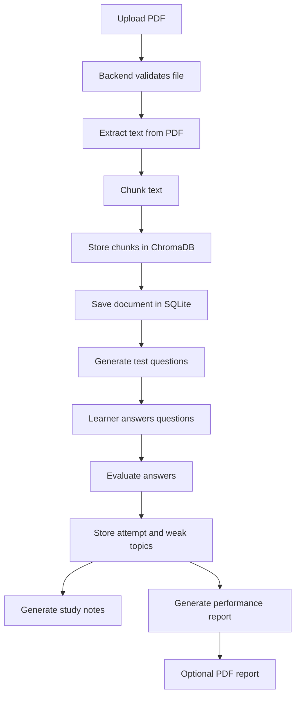

# LearnLoop AI

LearnLoop AI is an AI-assisted adaptive learning platform that turns a PDF into a personalized study loop. A learner uploads a document, the backend extracts and indexes the text, the system generates questions, the learner answers them, and the app identifies weak topics to produce targeted notes and performance reports.

## What This Project Does

The project is designed to help someone study from a PDF in a more active and measurable way:

1. Upload a PDF document.
2. Extract and chunk the text.
3. Store embeddings in ChromaDB for retrieval.
4. Generate a test from the uploaded content.
5. Submit answers and calculate the score.
6. Detect weak topics from incorrect answers.
7. Generate personalized notes focused on weak areas.
8. Generate a report and optional PDF summary for passed attempts.

## High-Level Workflow



## Main Features

- PDF upload with validation and size checks.
- AI-generated or fallback question generation.
- Adaptive reattempt flow focused on weak topics.
- Personalized notes based on the learner’s mistakes.
- Performance reports with history tracking.
- Dark and light theme support in the frontend.
- Backend fallback logic when AI service calls fail or are unavailable.

## Tech Stack

Backend:

- FastAPI
- SQLAlchemy with SQLite
- ChromaDB for vector search
- DeepSeek API for generation and analysis
- Uvicorn for serving

Frontend:

- React 18
- Vite
- React Router
- Axios
- Tailwind CSS
- Lucide React icons

## Repository Structure

```text
backend/
  config.py           Environment and app configuration
  main.py             FastAPI app setup and route registration
  database/           SQLite models and DB helpers
  rag/                PDF loading, chunking, retrieval, generation
  routes/             Upload, test, evaluation, notes, report APIs
  utils/              PDF report generation helpers
frontend/
  src/
    api.js            Frontend API wrapper
    App.jsx           Route setup
    components/       Shared UI components
    context/          Theme context
    pages/            App screens
reports/              Generated PDF reports
uploads/              Uploaded source PDFs
vector_db/            ChromaDB storage
adaptive_test.db      SQLite database file
```

## How The Application Works

### 1. Uploading a PDF

The learner goes to the upload page and selects a PDF. The backend:

- checks that the file is a PDF,
- enforces the 10 MB size limit,
- saves the file to `uploads/`,
- validates the PDF structure,
- extracts text,
- chunks the content,
- stores embeddings in ChromaDB,
- creates a document record in SQLite.

### 2. Generating a Test

Once the document is stored, the frontend navigates to the test page. The backend retrieves relevant chunks from the vector store and asks the AI layer to generate questions. If the AI call fails, the backend tries a fallback question generator so the learner can still continue.

### 3. Submitting Answers

When the learner submits answers, the backend:

- compares each answer with the expected answer,
- marks each item correct or incorrect,
- stores a score record for each question,
- calculates the final percentage,
- identifies weak topics from incorrect answers,
- stores the attempt in SQLite.

### 4. Generating Notes

The notes page uses the attempt ID to retrieve weak topics. The backend then fetches related chunks from the PDF and generates study notes focused on those topics. If the AI service is unavailable, the app falls back to document-based notes.

### 5. Generating Reports

For passed attempts, the report endpoint creates a summary report and optionally generates a PDF file in `reports/`. The report includes attempt history and performance analysis.

## Frontend Route Map

- `/` - Landing page
- `/upload` - PDF upload screen
- `/test/:documentId` - Question test screen
- `/notes/:attemptId` - Personalized study notes
- `/result` - Test result summary
- `/report/:attemptId` - Performance report

## Backend API Endpoints

Base URL in development: `http://127.0.0.1:8000/api`

- `POST /api/upload-pdf` - Upload and process a PDF.
- `POST /api/generate-test` - Generate questions for a document.
- `POST /api/submit-test` - Evaluate answers and store attempt data.
- `GET /api/generate-notes?attempt_id=...` - Generate personalized notes.
- `POST /api/reattempt-test` - Generate focused retry questions.
- `GET /api/generate-report?attempt_id=...` - Create report content and PDF.
- `GET /api/download-report/{report_id}` - Get report PDF metadata.
- `GET /api/attempts?document_id=...&user_id=...` - Fetch attempt history.
- `GET /api/health` - Health check.
- `GET /api/version` - API version.

## Data Models

The SQLite database stores the following objects:

- `User` - Basic user record.
- `Document` - Uploaded PDF metadata and Chroma collection reference.
- `Attempt` - Test attempt, score, pass/fail state, and weak topics.
- `Score` - Per-question evaluation results.
- `Report` - Saved report content and PDF path.

## Generated Files and Storage

- Uploaded PDFs are stored in `uploads/`.
- Generated report PDFs are stored in `reports/`.
- Vector embeddings are stored in `vector_db/chroma/`.
- The database file is `adaptive_test.db`.

These folders are created and reused automatically when the app runs.

## Requirements

- Python 3.12 or compatible Python 3.x environment.
- Node.js 18+ recommended.
- A valid DeepSeek API key.

## Environment Setup

Create a `.env` file in the project root:

```env
DEEPSEEK_API_KEY=your_api_key_here
```

The backend reads `DEEPSEEK_API_KEY` from the project root. Without it, the backend will stop on startup because AI generation is required for the main workflow.

## Installation

### Backend

Install Python dependencies:

```bash
pip install -r requirements.txt
```

If you are using the included virtual environment on Windows, you can activate it first:

```bash
venv_new\Scripts\activate
```

### Frontend

Install frontend dependencies:

```bash
cd frontend
npm install
```

## Running the Project

### Start the Backend

From the project root:

```bash
python run_backend.py
```

The backend runs at:

- API: `http://127.0.0.1:8000`
- Swagger docs: `http://127.0.0.1:8000/docs`

### Start the Frontend

From the `frontend` folder:

```bash
npm run dev
```

The Vite dev server runs at:

- Frontend: `http://127.0.0.1:5173`

The frontend is configured to proxy `/api` requests to the backend during development.

## Typical User Journey

1. Open the landing page.
2. Upload a PDF.
3. Wait for the app to process and index the document.
4. Take the generated test.
5. Review the score and weak topics.
6. Open personalized notes.
7. Retake the test with focused questions if needed.
8. Generate and download the report after a passing attempt.

## Important Behavior Notes

- The app currently uses a default `user_id=1` in the API flow. Authentication is not implemented yet.
- The backend supports fallback generation paths when AI requests fail, so the app can still function when the external service is unstable.
- Reports are only generated for passed attempts.
- The upload flow is optimized for educational PDFs with readable text, not scanned image-only PDFs.

## Troubleshooting

- If the backend fails on startup, check that `.env` exists and contains `DEEPSEEK_API_KEY`.
- If a PDF upload fails, verify that the file is a real PDF and smaller than 10 MB.
- If question generation is slow or fails, the AI service may be temporarily unavailable; the fallback mode should still try to produce usable output.
- If the frontend cannot reach the backend, confirm both servers are running and that the Vite proxy is targeting `http://127.0.0.1:8000`.

## Good Places To Start Reading The Code

- Backend entry point: `backend/main.py`
- Upload workflow: `backend/routes/upload.py`
- Test generation and reattempt logic: `backend/routes/test.py`
- Answer submission and weak-topic capture: `backend/routes/evaluate.py`
- Personalized notes: `backend/routes/notes.py`
- Reports: `backend/routes/report.py`
- Frontend route setup: `frontend/src/App.jsx`
- API wrapper: `frontend/src/api.js`

## Summary

This project is a closed learning loop: upload a document, test knowledge, measure weak areas, generate focused notes, and retest until the learner improves. The codebase is already organized around that flow, so this README should be enough for a new contributor or user to understand how the whole system fits together.